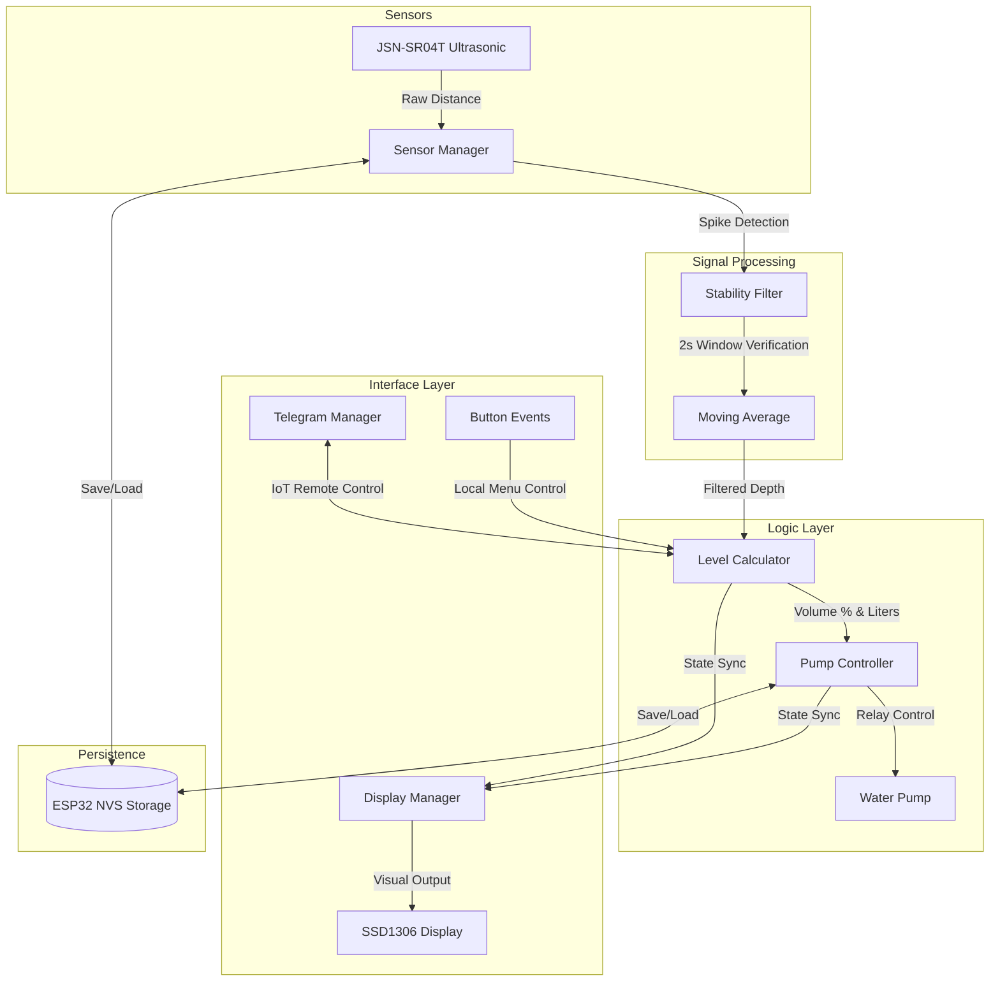

# 💧 Smart Water Tank Monitoring System

An advanced, ESP32-S3 based industrial-grade water tank management system featuring real-time ultrasonic leveling, localized OLED interaction, and remote IoT control via Telegram.

---

## 🚀 Project Overview

This project provides a robust solution for monitoring and controlling water tank levels. Built on the **ESP32-S3**, the system leverages ultrasonic sensors to measure water depth with high precision, calculates volume based on configurable tank geometries, and manages pump states automatically to prevent dry-runs or overflows. 

The system is designed for reliability in noisy environments, featuring custom signal processing filters and a power-loss resilient memory system.

---

## ✨ Key Features

*   **📏 High-Precision Leveling:** Real-time distance measurement using waterproof JSN-SR04T ultrasonic sensors (up to 610cm).
*   **📐 Flexible Tank Geometry:** Supports both **Cylindrical** and **Rectangular** (non-square) tanks with on-the-fly dimension configuration.
*   **🤖 Telegram IoT Integration:** Full remote control and status updates via a dedicated Telegram Bot.
*   **🖥️ Local OLED Interface:** 128x64 SSD1306 display providing status, network info, and a deep configuration menu.
*   **⚡ Smart Pump Control:** Automated threshold-based switching (e.g., ON at 15%, OFF at 85%) with manual button overrides.
*   **📂 Persistent Memory:** All configurations (dimensions, thresholds, pump states) are saved to NVS (Non-Volatile Storage) to survive power cycles.
*   **📡 WiFi provisioning:** Easy network setup using an On-Device Access Point portal.

---

## 🧠 Technical Deep Dive

### 1. The 2-Second Stability Snap Filter
Ultrasonic sensors in water tanks often suffer from "surface noise" caused by ripples, splashes, or reflections. A simple smoothing filter is too slow to react to real level changes, while no filter causes "pump chattering."

**The Solution:** I implemented a **Dual-Path Stability Filter**:
*   **The Smoothing Path:** For gradual changes, a circular buffer maintains a moving average to provide steady readings.
*   **The Snap Path:** If a large jump (>40cm) is detected, the system enters a "Verification State." It monitors a high-speed stability buffer for exactly **2 seconds** (10 samples). If the readings in that window are stable (within a 30cm range) but far from the current average, the system "snaps" the moving average instantly to the new level. This ignores momentary splashes while reacting instantly to rapid filling or draining.

### 2. Fast-Scroll Button Interaction Logic
Navigating a settings menu on a 5-button interface can be tedious if you need to change a value from 10 to 600.

**The Solution:** I engineered a **Temporal Auto-Repeat Engine**:
*   **Precision Mode:** A single click on the adjustment buttons triggers a `+/- 1` unit change.
*   **Turbo Mode:** If the button is held for more than **800ms**, the system switches to a recurring event mode. It automatically injects a `+/- 5` unit change every **300ms**. 
*   **Geometric Guarding:** The logic includes a context-aware toggle for non-numeric fields (like Shape), ensuring the hold-to-scroll logic only applies to dimensions and thresholds, preventing "flicker" on selection fields.

---

## 🏗️ System Architecture (Mermaid)

---

## 🛠️ Tech Stack

### Hardware
*   **MCU:** ESP32-S3 DevKit
*   **Sensor:** JSN-SR04T Waterproof Ultrasonic Sensor
*   **Display:** 0.96" SSD1306 OLED (I2C)
*   **Actuator:** 5V/220V Relay Module
*   **Input:** 5-Button Navigation Array

### Software
*   **Framework:** Arduino Core for ESP32
*   **Build System:** PlatformIO
*   **Libraries:**
    *   `WiFiManager`: For captive portal provisioning.
    *   `UniversalTelegramBot`: For SSL-secured IoT communication.
    *   `Adafruit GFX/SSD1306`: For low-level display driver management.
    *   `Preferences`: For EEPROM-like NVS storage.
    *   `AsyncDelay`: For non-blocking task management.

---

## 📝 Engineering Standards Applied
*   **Non-Blocking Design:** No `delay()` calls are used; the system uses a tick-based task scheduler to ensure the UI remains responsive even during sensor reads or WiFi handshake.
*   **Memory Efficiency:** Used circular buffers and fixed-point math where possible to minimize heap fragmentation.
*   **Safety Interlocks:** Implemented software-level "Dry-Run" protection and high-water overrides to prevent hardware damage.
